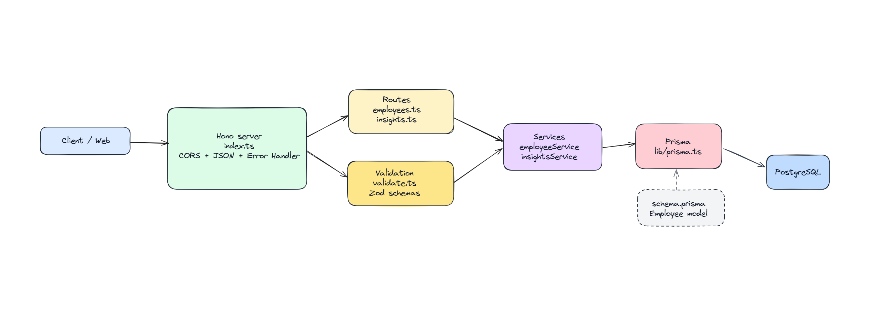

# Employee Management System

A full-stack employee management application built with a monorepo architecture using **Turborepo**, **npm workspaces**, and **TypeScript**. The system provides a modern dashboard for managing employee records with advanced filtering, pagination, sorting, and rich analytics/insights visualizations.

## Architecture



## Project Structure

```
employee-management/
├── apps/
│   ├── api/                    # Hono REST API — backend
│   └── web/                    # Next.js 16 — frontend dashboard
├── packages/
│   ├── eslint-config/          # Shared ESLint flat config presets
│   └── typescript-config/      # Shared TypeScript config presets
├── artifacts/                  # Architecture diagrams & assets
├── turbo.json                  # Turborepo pipeline configuration
└── package.json                # Workspace root (npm workspaces)
```

## Tech Stack

### Frontend (`apps/web`)

| Category                   | Technology                                                               |
| -------------------------- | ------------------------------------------------------------------------ |
| **Framework**              | Next.js 16 (App Router, React Server Components, React Compiler)         |
| **UI Library**             | React 19, shadcn/ui (Radix UI v4 primitives)                             |
| **Styling**                | Tailwind CSS v4, `tw-animate-css`, `class-variance-authority`            |
| **State Management**       | @tanstack/react-query v5 (server state), react-hook-form v7 (form state) |
| **Charts & Visualization** | Recharts, @number-flow/react (animated counters)                         |
| **Icons**                  | HugeIcons (@hugeicons/react)                                             |
| **Tables**                 | @tanstack/react-table v8 (sortable, paginated, column visibility)        |
| **Theming**                | next-themes (dark/light/system)                                          |
| **Drag & Drop**            | @dnd-kit (core, sortable, modifiers)                                     |
| **Date Handling**          | date-fns v4, react-day-picker v10                                        |
| **Notifications**          | sonner (toast system)                                                    |
| **Drawer**                 | vaul                                                                     |
| **Animation**              | motion (Framer Motion successor)                                         |
| **Validation**             | Zod v4 (@hookform/resolvers)                                             |
| **Forms**                  | react-hook-form with Zod schema validation                               |

### API (`apps/api`)

| Category          | Technology                                                 |
| ----------------- | ---------------------------------------------------------- |
| **Framework**     | Hono v4 (lightweight, TypeScript-native)                   |
| **Server**        | @hono/node-server                                          |
| **OpenAPI**       | @hono/zod-openapi, hono-openapi, stoker                    |
| **API Docs**      | Auto-generated OpenAPI 3.0 spec + Swagger UI at `/swagger` |
| **ORM**           | Prisma v7 (@prisma/client, @prisma/adapter-pg)             |
| **Database**      | PostgreSQL                                                 |
| **Validation**    | Zod v4                                                     |
| **Logging**       | Pino (structured JSON) + pino-pretty                       |
| **Rate Limiting** | hono-rate-limiter (100 requests / 15 minutes)              |
| **Security**      | CORS configured, global error handling                     |
| **Testing**       | Vitest (unit tests for all route handlers)                 |

### Infrastructure & Tooling

| Category            | Technology                                                                |
| ------------------- | ------------------------------------------------------------------------- |
| **Monorepo**        | Turborepo v2 + npm workspaces                                             |
| **Language**        | TypeScript 5 (strict mode throughout)                                     |
| **Linting**         | ESLint v9 (flat config) with TypeScript, React, Next.js, Prettier plugins |
| **Formatting**      | Prettier                                                                  |
| **DevOps**          | AWS CDK v2 (infrastructure as code)                                       |
| **Deployment**      | AWS Lambda (Node.js 22) via Function URL, esbuild bundling                |
| **Package Manager** | npm 11                                                                    |

## API Endpoints

All endpoints are mounted under `/api/v1` and documented via Swagger UI at `/swagger`.

### Employee CRUD

| Method   | Endpoint                | Description                                                                                                                                               |
| -------- | ----------------------- | --------------------------------------------------------------------------------------------------------------------------------------------------------- |
| `GET`    | `/api/v1/employee`      | Paginated employee list. Supports `search`, `country`, `department`, `jobTitle`, `employmentType`, `sortBy`, `sortOrder`, `page`, `pageSize` query params |
| `GET`    | `/api/v1/employee/{id}` | Get single employee by UUID                                                                                                                               |
| `POST`   | `/api/v1/employee`      | Create a new employee                                                                                                                                     |
| `PATCH`  | `/api/v1/employee/{id}` | Update an existing employee                                                                                                                               |
| `DELETE` | `/api/v1/employee/{id}` | Delete an employee                                                                                                                                        |

### Insights / Analytics

| Method | Endpoint                                | Description                                                                |
| ------ | --------------------------------------- | -------------------------------------------------------------------------- |
| `GET`  | `/api/v1/insights/salary-by-country`    | Salary statistics grouped by country                                       |
| `GET`  | `/api/v1/insights/salary-by-department` | Salary statistics grouped by department                                    |
| `GET`  | `/api/v1/insights/salary-by-job-title`  | Salary statistics by job title (optional `?country=` filter)               |
| `GET`  | `/api/v1/insights/salary-distribution`  | Employee count by salary band (0–30k, 30k–60k, …, 120k+)                   |
| `GET`  | `/api/v1/insights/top-earners`          | Top N highest-paid employees (`?limit=N`)                                  |
| `GET`  | `/api/v1/insights/global-summary`       | Aggregate stats: total employees, avg/median/min/max salary, total payroll |

## Frontend App Structure

```
apps/web/src/
├── app/                          # Next.js App Router pages
│   ├── employees/
│   │   ├── page.tsx              # Employee list with table + filters
│   │   ├── [id]/page.tsx         # Employee detail + inline edit
│   │   └── new/page.tsx          # Create employee form
│   ├── layout.tsx                # Root layout (sidebar, providers, fonts)
│   ├── page.tsx                  # Dashboard homepage (cards, charts)
│   ├── globals.css               # Tailwind v4 global styles
│   └── error.tsx                 # Error boundary
├── components/
│   ├── ui/                       # 26 shadcn/ui primitives
│   ├── employee/                 # Employee detail, form fields, layouts
│   ├── employees/                # Employee table, filters
│   ├── sidebar/                  # App sidebar + site header
│   └── *.tsx                     # Dashboard widgets (SectionCards, SalaryDistribution, etc.)
├── lib/
│   ├── apis/
│   │   ├── employee/             # Employee API fetcher + React Query options
│   │   └── insights/             # Insights API fetcher + React Query options
│   ├── employee-filters.ts       # URL search params ↔ EmployeeFilters
│   └── utils.ts                  # cn() helper
├── providers/                    # QueryClient, Theme, Tooltip providers
├── types/
│   └── api-types.ts              # Shared TypeScript interfaces
└── utils/
    ├── request.ts                # Base fetch wrapper
    └── handleResponse.ts         # Response error handling
```

## API App Structure

```
apps/api/src/
├── app.ts                        # Route mounting entry point
├── index.ts                      # Server bootstrap (Hono Node server, port 4000)
├── create-app.ts                 # App factory with CORS, logging, rate-limit
├── env.ts                        # Zod-validated environment configuration
├── constants/
│   └── employee.ts               # Seed data constants (countries, departments, job titles)
├── lib/
│   ├── prisma.ts                 # Prisma client singleton
│   ├── api-error.ts              # Custom ApiError class
│   ├── configure-open-api.ts     # Swagger UI setup
│   └── types.ts                  # AppBinding, AppOpenAPI, AppRouteHandler
├── middlewares/
│   ├── not-found.ts              # 404 handler
│   ├── on-error.ts               # Global error handler
│   ├── pino-logger.ts            # Structured logging middleware
│   └── rate-limit.ts             # Rate limiter middleware
├── routes/
│   ├── employee/                 # CRUD route definitions + handlers
│   └── insights/                 # Analytics route definitions + handlers
├── services/
│   ├── employeeService.ts        # Business logic: CRUD, filtering, pagination
│   └── insights.ts               # Analytics queries: salary stats, distributions
└── types/
    └── types.ts                  # Zod schemas + inferred TypeScript types
```

## Database Model

```prisma
model Employee {
  id             String   @id @default(uuid())
  fullName       String
  jobTitle       String
  department     String
  country        String
  salary         Float
  currency       String   @default("USD")
  email          String   @unique
  employmentType String   @default("Full-time")
  hireDate       DateTime @default(now())
  createdAt      DateTime @default(now())
  updatedAt      DateTime @updatedAt

  @@index([country])
  @@index([country, jobTitle])
}
```

## Getting Started

### Prerequisites

- Node.js >= 18
- npm 11+
- PostgreSQL instance

### Setup

```sh
# Install all dependencies (workspaces)
npm install

# Set up environment variables
cp apps/api/.env.example apps/api/.env
cp apps/web/src/app/.env.example apps/web/src/app/.env

# Run database migrations + seed data
npm run dev --workspace=@employee-management/api
```

### Development

```sh
# Run both apps concurrently with Turborepo
npm run dev
```

- **Frontend**: http://localhost:3000
- **API**: http://localhost:4000
- **API Docs (Swagger UI)**: http://localhost:4000/swagger

### Build

```sh
npm run build
```

### Lint & Type Check

```sh
npm run lint
npm run check-types
```

## Deployment

The API is deployable to AWS via CDK as a Lambda function with a Function URL (no API Gateway). Infrastructure code is in `apps/api/infra/stack.ts`.

```sh
# Deploy API to AWS
cd apps/api
npx cdk deploy
```
